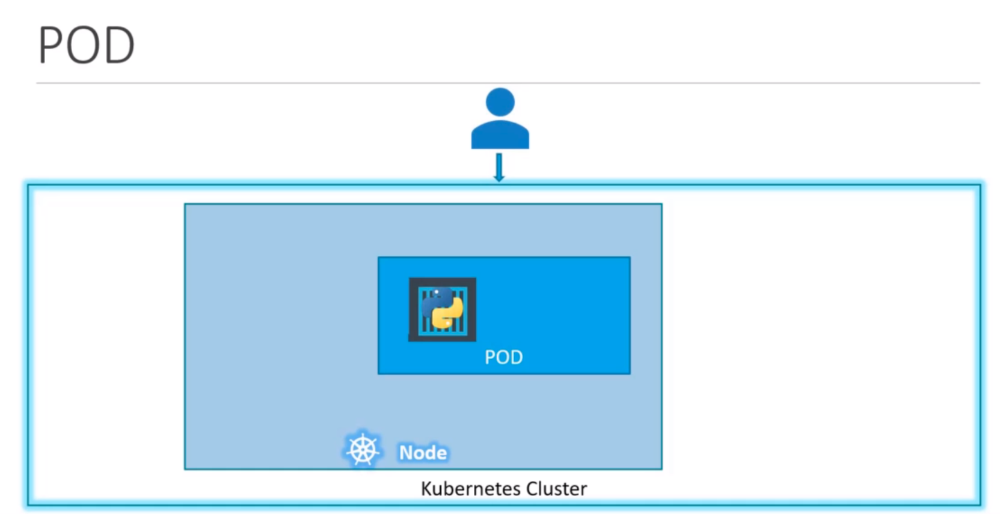
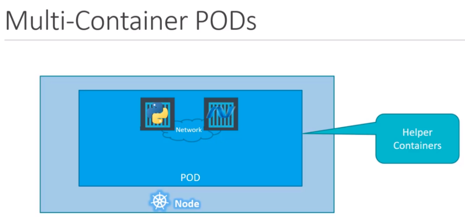
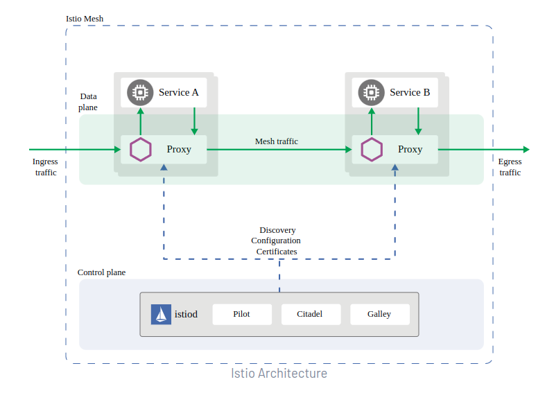
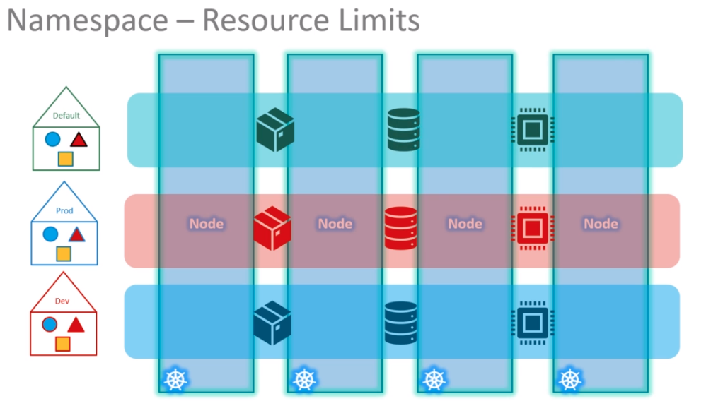
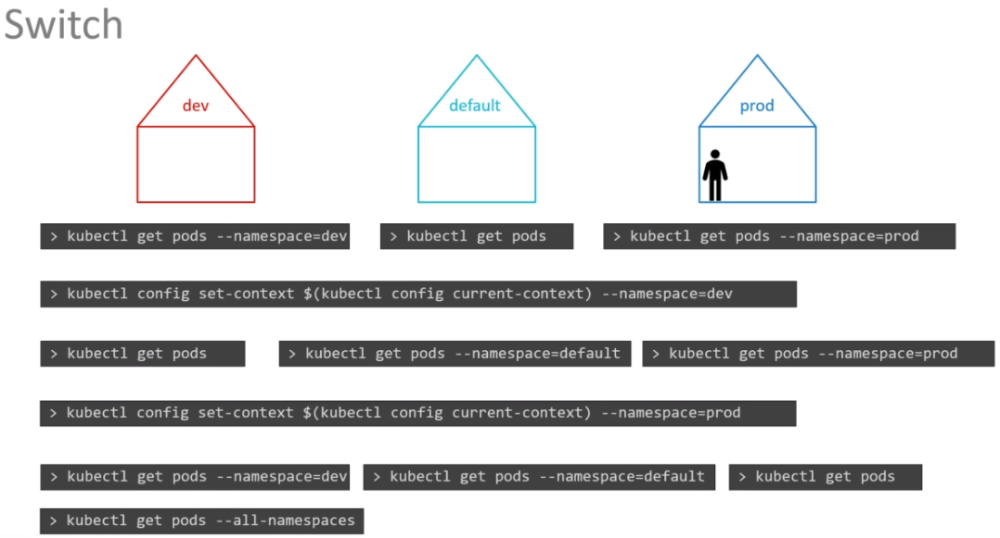

# CKAD Preparation

Exam: https://www.cncf.io/certification/ckad/
Course: https://www.udemy.com/course/certified-kubernetes-application-developer/

## Core Concepts of K8S Architecture

### Cluster

Set of nodes grouped.

- [Official Doc](https://kubernetes.io/docs/concepts/overview/components/)

> When you deploy Kubernetes, you get a cluster. A Kubernetes cluster consists of a set of worker machines, called nodes, that run
> containerized applications. Every cluster has at least one worker node.

### Nodes

A worker machine in Kubernetes

- [Official Doc](https://kubernetes.io/docs/concepts/architecture/nodes/)

> Kubernetes runs your workload by placing containers into Pods to run on Nodes. A node may be a virtual or physical machine,
> depending on the cluster. Each node is managed by the control plane and contains the services necessary to run Pods. Typically
> you have several nodes in a cluster; in a learning or resource-limited environment, you might have only one node. The components
> on a node include the kubelet, a container runtime, and the kube-proxy.


## Control Plane Components

### **Master Node**

Another node with Kubernetes in it. It is responsible for the orchestration of worker
nodes within a cluster. It embeds the Kube API Server.

### Kube API Server

Frontend for Kubernetes. User management devices, CLI, etc. talk directly with
the API server to interact with a Cluster.

### `etcd` Key Store

Distributed reliable key-value store used by Kubernetes to store all data used
to manage the cluster. When you have multiple nodes and master, `etcd` stores all
that information in all the nodes of the cluster in a distributed manner.

It also implements logs within a cluster to ensure no conflict between masters.

### kube-controller-manager

Responsible for noticing and responding when nodes, containers, endpoints go
down, etc. - it makes decisions to bring up new containers, in such cases.

### [kube-scheduler](https://kubernetes.io/docs/concepts/overview/components/#kube-scheduler)

Control plane component that watches for newly created Pods with no assigned node,
and selects a node for them to run on.

Factors taken into account for scheduling decisions include individual and collective
resource requirements, hardware/software/policy constraints, affinity and anti-affinity
specifications, data locality, inter-workload interference, and deadlines.

## cloud-controller-manager

A Kubernetes control plane component that embeds cloud-specific control logic. The cloud
controller manager lets you link your cluster to your cloud provider's API and separates
the components that interact with that cloud platform from components that only interact
with your cluster.

## **Worker Nodes**

Where the containers are hosted, thus make use of a Container Runtime.
To communicate with the Kube API Server from the Master node, the worker nodes
embed the `kubelet`` service

### kubelet

Agent that runs on each node in the cluster, responsible for making sure the
containers are running in the nodes as expected. Communicates with the Kube API
server from the Master node.

### Container Runtime

Underlying software used to run containers. Docker runtime is the most common
one, but there are a few others

* [rkt](https://www.redhat.com/pt-br/topics/containers/what-is-rkt): maintained by RedHat
* [CRI-O](https://cri-o.io/): Cloud Native Computing Foundation incubating project


## Kubectl CLI

Deploy and manage applications in a Kubernetes cluster:
* Cluster information: `kubectl cluster-info`
* Status of other nodes: `kubectl get nodes`
* Manage other resources

Cheat Sheet: https://kubernetes.io/docs/reference/kubectl/cheatsheet/

------

## Other Components

## Pod

Pods are the smallest working units of Kubernetes which runs a single instance
of an application.



Pods run on top of a Node. When a Node does not have available resources to
deploy new pods, then the scheduler deploys a new Node to run that pod.

Pods usually have a 1:1 relationship with containers. To scale up an application,
one must create new pods, rather than new containers for an existing pod.

The load balancer between the containers is handled by a separate entity.

Official Doc: https://kubernetes.io/docs/concepts/workloads/pods/

## Multi-Container Pods

Even though pods and containers usually have a 1:1 relationship, it is not
strictly enforced, thus we can have multiple containers running in a single pod.

One scenario for this would be helper containers that might be doing some kind
of supportive task for a web application, i.e: processing a file uploaded by the
user, etc. In that case, both containers are part of the same pod and share the
same network space (`localhost`) - they can easily share the same storage space
as well.



One common application would be [Envoy](https://www.envoyproxy.io/) sidecar,
which is a reverse proxy that [istio](https://istio.io/) injects into the
application's pods.



### Deploying via Kubectl imperatively

There are two ways of deploying a pod using `kubectl` CLI, the first one is
imperatively using `kubectl run` passing as an argument the image of the container.
What it does is first create the pod, then fetch the image from the
docker hub registry, which gets finally deployed as a container inside the pod.

```bash
$ kubectl run nginx --image=nginx
pod/nginx created
$ kubectl get pods
NAME    READY   STATUS    RESTARTS   AGE
nginx   1/1     Running   0          6s
```

### Deploying via Kubectl declaratively

Declarative deploys need a YAML file specifying the resource that is going to
be created. To create via `kubectl` we need to `apply`:

```yaml
apiVersion: v1
kind: Pod
metadata:
  name: nginx
  labels:
    app: nginx
    type: webserver
spec:
  containers:
  - name: nginx
    image: nginx
    imagePullPolicy: IfNotPresent
```

```bash
$ kubectl apply -f ./examples/nginx-pod.yaml
pod/nginx created
$ kubectl get pods
NAME    READY   STATUS    RESTARTS   AGE
nginx   1/1     Running   0          15s
```

### Deleting

To delete a pod via `kubectl`:

```bash
$ kubectl delete pod nginx
pod "nginx" deleted
```

## ReplicaSet

ReplicaSet is a type of controller whose purpose is to maintain a stable set
of replica Pods running at any given time. As such, it is often used to
guarantee the availability of a specified number of identical Pods.

Provides high availability by running multiple instances of a single pod. Even
in single-pod scenarios, the ReplicaSet is still useful by bringing up new pods
if the previous one crashed or went down.

It shares the load across multiple pods.

Official Doc: https://kubernetes.io/docs/concepts/workloads/controllers/replicaset/

### Deploying declaratively (YAML)

```yaml
apiVersion: apps/v1
kind: ReplicaSet
metadata:
  name: nginx-rs
  labels:
    type: webserver
spec:
  replicas: 2
  selector:
    matchLabels:
      type: webserver
  template:
    metadata:
      name: nginx-pod
      labels:
        name: nginx
        type: webserver
    spec:
      containers:
      - name: nginx-container
        image: nginx
        imagePullPolicy: IfNotPresent
```

And creating:

```bash
$ kubectl apply -f ./exmaples/nginx-rs.yaml
replicaset.apps/app-rs created
$ kubectl get rs
NAME    DESIRED   CURRENT   READY   AGE
nginx   2         2         2       12m
$ kubectl get pods
NAME          READY   STATUS    RESTARTS   AGE
nginx-749sr   1/1     Running   0          2m
nginx-qdqrn   1/1     Running   0          2m
```

It is important to specify the **selector** since this will be used by the
ReplicaSet to match what pods it should consider under its control. This also
makes it possible for ReplicaSets to monitor already existing pods.

The **template** section is used to specify how the pod should be created if
the ReplicaSet needs to bring up a new pod.

### Updating the Replicas

1. Change the number of `replicas` in the YAML and apply with: `kubectl replace -f nginx-rs.yaml`
2. Use `kubectl scale --replicas=6 -f nginx-rs.yaml`, this won't change the actual
number of replicas in `nginx-rs.yaml`
3. Use `kubectl scale --replicas=6 replicaset nginx`, this won't change the actual
number of replicas in `nginx-rs.yaml`

To change the number of replicas dynamically, using throughput for example, we
need an HPA (Horizontal Pod Autoscaler).

## Deployments

A Deployment provides declarative updates for Pods and ReplicaSets.

You describe a desired state in a Deployment, and the Deployment Controller
changes the actual state to the desired state at a controlled rate. You can
define Deployments to create new ReplicaSets or to remove existing Deployments
and adopt all their resources with new Deployments.

Official Doc: https://kubernetes.io/docs/concepts/workloads/controllers/deployment/

### YAML

```yaml
apiVersion: apps/v1
kind: Deployment
metadata:
  name: nginx
  labels:
    type: webserver
spec:
  replicas: 2
  selector:
    matchLabels:
      type: webserver
  template:
    metadata:
      name: nginx-pod
      labels:
        name: nginx
        type: webserver
    spec:
      containers:
      - name: nginx-container
        image: nginx
        imagePullPolicy: IfNotPresent
```

To deploy:

```bash
$ kubectl apply -f ./examples/deployment.yaml
deployment.apps/nginx created

$ kubectl get deploy
NAME    READY   UP-TO-DATE   AVAILABLE   AGE
nginx   2/2     2            2           5s

$ kubectl get rs
NAME               DESIRED   CURRENT   READY   AGE
nginx-5788499b89   2         2         2       10s

$ kubectl get pods
NAME                     READY   STATUS    RESTARTS   AGE
nginx-5788499b89-j77sx   1/1     Running   0          75s
nginx-5788499b89-xfw5b   1/1     Running   0          75s
```

## Namespaces

In Kubernetes, namespaces provide a mechanism for isolating groups of resources
within a single cluster. Names of resources need to be unique within a
namespace, but not across namespaces. Namespace-based scoping is applicable only
for namespaced objects (e.g. Deployments, Services, etc) and not for
cluster-wide objects (e.g. StorageClass, Nodes, PersistentVolumes, etc).

Kubernetes starts with four initial namespaces:

* `default`: The default namespace for objects with no other namespace
* `kube-system`: The namespace for objects created by the Kubernetes system
* `kube-public`: This namespace is created automatically and is readable by all
users (including those not authenticated). This namespace is mostly reserved for
cluster usage, in case some resources should be visible and readable
publicly throughout the whole cluster. The public aspect of this namespace is
only a convention, not a requirement.
* `kube-node-lease`: This namespace holds Lease objects associated with each
node. Node leases allow the kubelet to send heartbeats so that the control plane
can detect node failure.

- [Official Doc](https://kubernetes.io/docs/concepts/overview/working-with-objects/namespaces/)



### YAML Deploy

```yaml
apiVersion: v1
kind: Namespace
metadata:
  name: playground
spec:
```

To deploy:

```bash
$ kubectl apply -f ./examples/namespace.yaml
namespace/playground created

$ kubectl get namespaces
NAME                   STATUS   AGE
default                Active   7d9h
kube-node-lease        Active   7d9h
kube-public            Active   7d9h
kube-system            Active   7d9h
kubernetes-dashboard   Active   7d5h
playground             Active   9s
```
To create a deployment in this namespace:

```diff
diff --git a/examples/deployment.yaml b/examples/deployment.yaml
index 0d7cf35..2a8a299 100644
--- a/examples/deployment.yaml
+++ b/examples/deployment.yaml
@@ -2,6 +2,7 @@ apiVersion: apps/v1
 kind: Deployment
 metadata:
   name: nginx
+  namespace: playground
   labels:
     type: webserver
 spec:
```

And apply:

```bash
$ kubectl apply -f ./examples/deployment.yaml
deployment.apps/nginx created

$ kubectl -n playground get deployments
NAME    READY   UP-TO-DATE   AVAILABLE   AGE
nginx   2/2     2            2           25s
```

To switch between default namespaces:

```bash
kubectl config set-context $(kubectl config current-context) --namespace=playground
```



## Resource Quota

When several users or teams share a cluster with a fixed number of nodes, there
is a concern that one team could use more than its fair share of resources.

Resource quotas are a tool for administrators to address this concern.

A resource quota, defined by a ResourceQuota object, provides constraints that
limit aggregate resource consumption per namespace. It can limit the number of
objects that can be created in a namespace by type, as well as the total amount
of compute resources that may be consumed by resources in that namespace.

- [Official Doc](https://kubernetes.io/docs/concepts/policy/resource-quotas/)

### YAML Deploy

The following will match each pod with `priorityClassName: high` in its
definition, on the `playground` namespace to the quota.

```yaml
apiVersion: v1
kind: ResourceQuota
metadata:
  name: playground-quota
  namespace: playground
spec:
  hard:
    cpu: "4"
    memory: "4Gi"
    pods: 20
  scopeSelector:
      matchExpressions:
      - operator : In
        scopeName: PriorityClass
        values: ["high"]
```

To deploy:

```bash
$ kubectl apply -f ./examples/resource-quota.yaml
resourcequota/playground-quota created

$ kubectl -n playground describe quota
Name:       playground-quota
Namespace:  playground
Resource    Used  Hard
--------    ----  ----
cpu         0     4
memory      0     4Gi
pods        0     20
```

## ConfigMap

A ConfigMap is an API object used to store non-confidential data in key-value pairs.
Pods can consume ConfigMaps as environment variables, command-line arguments, or
configuration files in a volume.

A ConfigMap allows you to decouple environment-specific configuration from your
container images so that your applications are easily portable.

Official Doc: https://kubernetes.io/docs/concepts/configuration/configmap/

### Imperative Deploy

One can create imperatively by using:

```bash
$ kubectl create configMap my-config1 \
  --from-literal=ENV_1='VALUE_1' \
  --from-literal=ENV_2='VALUE_2'
configmap/my-config1 created

$ kubectl get configmap
NAME               DATA   AGE
kube-root-ca.crt   1      20d
my-config1         2      25s

$ kubectl describe configmap my-config1
Name:         my-config1
Namespace:    default
Labels:       <none>
Annotations:  <none>

Data
====
ENV_1:
----
VALUE_1
ENV_2:
----
VALUE_2
Events:  <none>
```

Or, one can store the values in a file, i.e:

```properties
# examples/config.properties
ENV_1: VALUE_1
ENV_2: VALUE_2
```

And then reference the file in the command:

```bash
$ kubectl create configmap my-config2 --from-file=examples/config.properties
configmap/my-config2 created

$ kubectl get configmap
NAME               DATA   AGE
kube-root-ca.crt   1      20d
my-config1         2      25m
my-config2         1      4s

$ kubectl describe configmap my-config2
Name:         my-config2
Namespace:    default
Labels:       <none>
Annotations:  <none>

Data
====
config.properties:
----
ENV_1: VALUE_1
ENV_2: VALUE_2

Events:  <none>
```

### YAML Deploy

```yaml
apiVersion: v1
kind: ConfigMap
metadata:
  name: my-config3
data:
  FOO: "BAR"
  XPTO: "ACME"
```

Then, we apply:

```bash
$ kubectl apply -f examples/configmap.yaml
configmap/my-config3 created

$ kubectl describe configmap my-config3
Name:         my-config3
Namespace:    default
Labels:       <none>
Annotations:  <none>

Data
====
FOO:
----
BAR
XPTO:
----
ACME
Events:  <none>
```
### Connecting Pod to ConfigMap

To connect a Pod or deployment to a ConfigMap, one can use the `env` key in the Pod or
Deployment YAML:

```yaml
apiVersion: v1
kind: Pod
metadata:
  name: nginx
  labels:
    app: nginx
    type: webserver
spec:
  containers:
  - name: nginx
    image: nginx
    imagePullPolicy: IfNotPresent
  - envFrom:
    - configMapRef:
        name: my-config3
```

## Secrets

A ConfigMap is an API object used to store non-confidential data in key-value pairs.
Pods can consume ConfigMaps as environment variables, command-line arguments, or
configuration files in a volume.

A ConfigMap allows you to decouple environment-specific configuration from your
container images so that your applications are easily portable.

Official Doc: https://kubernetes.io/docs/concepts/configuration/configmap/

### Imperative Deploy
