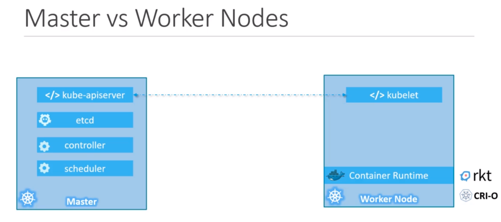

## **Master Node**

Another node with Kubernetes in it, responsible for the orchestration of worker
nodes within a cluster. It embeds the Kube API Server.

### API Server

Frontend for Kubernetes. User management devices, CLI, etc. talk directly with
API server to interact with a Cluster.

### `etcd` Key Store

Distributed reliable key-value store used by Kubernetes to store all data used
to manage the cluster. When you have multiple nodes and master, etcd stores all
that information in all the nodes of the cluster in a distributed manner.

It also implements logs within a cluster to ensure no conflict between masters.

### Controller

Responsible for noticing and responding when nodes, containers, endpoints goes
down, etc. - it makes decision to bring up new containers, in such cases.

### Scheduler

Responsible for distributing work, or containers, across multiple nodes. Assign
newly-created containers to nodes.

## **Worker Nodes**

Where the containers are hosted, thus make use of a Container Runtime.
To communicate with the Kube API Server from the Master node, the worker nodes
embeds the kubelet service

### kubelet

Agent that runs on each node in the cluster, responsible for making sure the
containers are running in the nodes as expected. Communicates with the Kube API
server from the Master node.

### Container Runtime

Underlying software used to run containers. Docker runtime is the most common
one, but there are a few others:
* [rkt](https://www.redhat.com/pt-br/topics/containers/what-is-rkt): maintained by RedHat
* [CRI-O](https://cri-o.io/): Cloud Native Computing Foundation incubating project

## Kubectl CLI

Deploy and manage applications in a Kubernetes cluster:
* Cluster information: `kubectl cluster-info`
* Status of other nodes: `kubectl get nodes`
* Manage other resources

Cheat Sheet: https://kubernetes.io/docs/reference/kubectl/cheatsheet/
